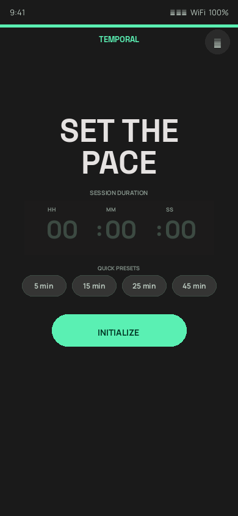
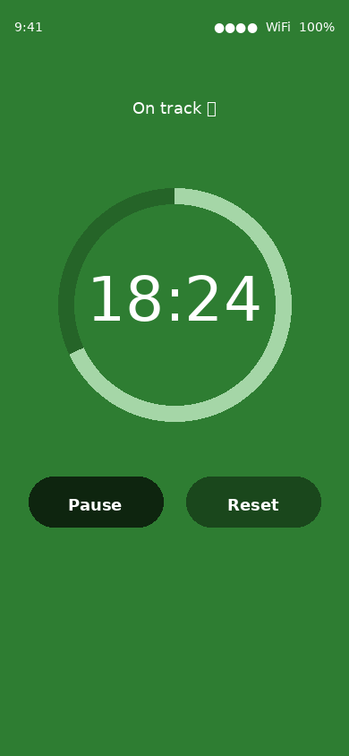
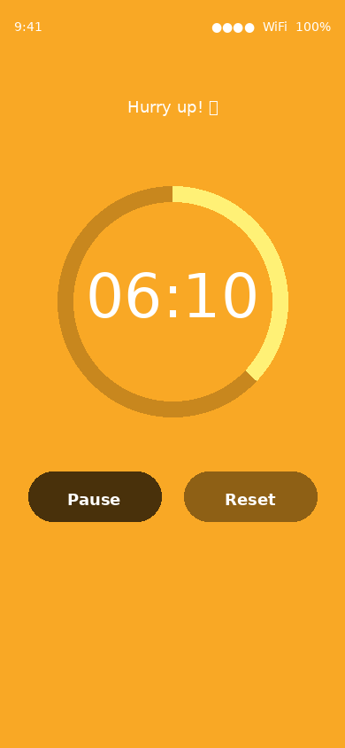
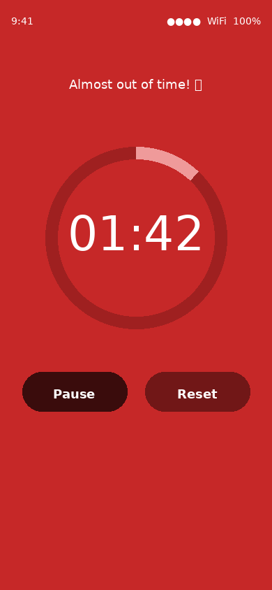
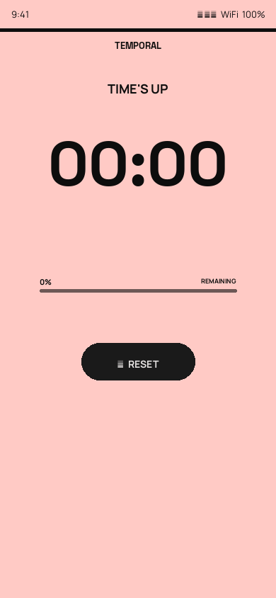
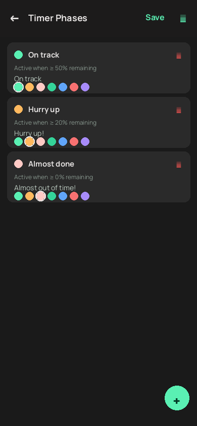
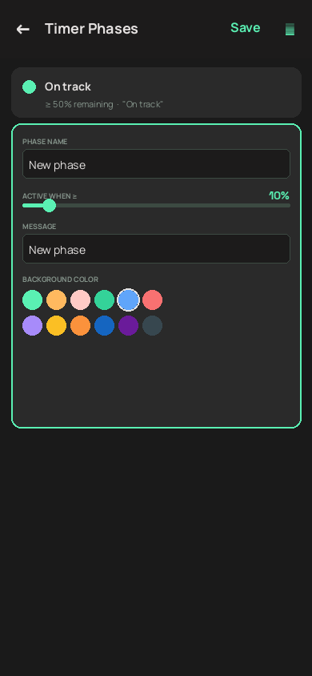
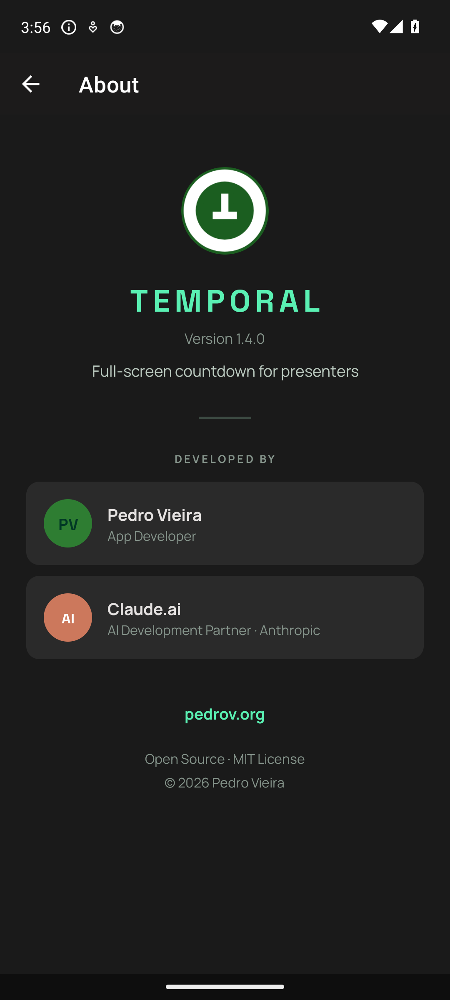

# PresentationTimer — User Manual

**Version 1.2.0**

---

## Table of Contents

1. [Overview](#1-overview)
2. [Installation](#2-installation)
3. [Quick Start](#3-quick-start)
4. [Timer Screen](#4-timer-screen)
   - [Setup](#41-setup)
   - [Running](#42-running)
   - [Paused](#43-paused)
   - [Time's Up](#44-times-up)
5. [Configuring Phases](#5-configuring-phases)
   - [Opening Settings](#51-opening-settings)
   - [Editing a Phase](#52-editing-a-phase)
   - [Adding a Phase](#53-adding-a-phase)
   - [Deleting a Phase](#54-deleting-a-phase)
   - [Saving Changes](#55-saving-changes)
6. [Phase Logic Explained](#6-phase-logic-explained)
7. [Tips for Presenters](#7-tips-for-presenters)
8. [About](#8-about)

---

## 1. Overview

**PresentationTimer** is a full-screen countdown timer designed for speakers and presenters. The entire screen changes colour as your time runs out, so you can check your progress with a single glance — no fumbling with a watch, no squinting at a tiny clock.

Out of the box it has three phases (green → yellow → red), but you can add as many phases as you like and customise the colour, threshold, and message of each one.

---

## 2. Installation

### From GitHub Releases (recommended)

1. On your Android phone, open the browser and go to:  
   **https://github.com/pedroaovieira/PresentationApp/releases/latest**
2. Tap **app-debug.apk** to download it.
3. When prompted, allow your browser to install unknown apps:  
   **Settings → Apps → Special app access → Install unknown apps → [your browser] → Allow**
4. Tap the downloaded file in the notification shade or in Downloads.
5. Tap **Install** and then **Open**.

### From the command line (developer)

```bash
adb install app/build/outputs/apk/debug/app-debug.apk
```

> **Requirements:** Android 8.0 (API 26) or higher.

---

## 3. Quick Start

1. Open **PresentationTimer** on your phone.
2. Enter your presentation duration — hours, minutes, seconds.
3. Tap **Start**.
4. Put the phone face-up on the lectern or prop it where you can see it.
5. Glance at the screen colour whenever you need a time check.

That's it.

---

## 4. Timer Screen

### 4.1 Setup



When you first open the app you see the **setup screen**:

| Element | Description |
|---|---|
| Gear icon (top-right) | Opens the phase settings |
| Arc ring | Full circle — no time has passed yet |
| **HH : MM : SS** fields | Enter your desired duration |
| **Start** button | Begins the countdown |

**Enter your time:** Tap each field (HH, MM, SS) and type the number. You only need to fill the fields you use — e.g., type `25` in MM for a 25-minute talk.

---

### 4.2 Running

| Green phase | Yellow phase | Red phase |
|:---:|:---:|:---:|
|  |  |  |

While the timer is running:

- The **background colour** changes to match the active phase.
- The **arc ring** sweeps anticlockwise showing time consumed.
- The **phase message** appears at the top (e.g., "On track 🟢").
- The remaining **time** is shown in large digits at the centre.

**Controls while running:**

| Button | Action |
|---|---|
| **Pause** | Freezes the countdown. Tap **Resume** to continue. |
| **Reset** | Cancels the timer and returns to the setup screen. |

---

### 4.3 Paused

When paused the background stays the same colour as when you paused and the label changes to **"Paused ⏸"**. The **Resume** button replaces **Pause**.

---

### 4.4 Time's Up



When the countdown reaches zero:

- The screen shows the last (lowest-threshold) phase colour.
- The timer **flashes** to grab your attention.
- The label reads **"Time's up! ⏰"**.
- Tap **Reset** to go back to setup.

---

## 5. Configuring Phases

### 5.1 Opening Settings


Tap the **gear icon** in the top-right corner of the setup screen. The phases editor opens.

> The settings button is only visible on the setup screen (not while a timer is running).

---

### 5.2 Editing a Phase



Each phase is shown as a card with four editable fields:

| Field | What it does |
|---|---|
| **Phase name** | A label for your own reference (not shown during the timer). |
| **Active when ≥ X% remaining** | The minimum percentage of time remaining for this phase to be active. For example, `50` means this phase shows when more than half the time is left. |
| **Message** | The text shown at the top of the screen while this phase is active. Emojis are supported. |
| **Background color** | Tap any colour swatch to select it. The selected colour is highlighted with a white ring. |

All fields save automatically when you press **Save** or navigate back.

---

### 5.3 Adding a Phase



Tap the green **+** button (bottom-right) to add a new phase card. A default card appears at the bottom of the list — edit its name, threshold, message, and colour just like any other phase.

**Example — adding a "Wrap up" phase:**

| Field | Value |
|---|---|
| Phase name | Wrap up |
| Active when ≥ | 10 |
| Message | Start wrapping up! |
| Colour | Orange (#E65100) |

This phase would appear during the last 10% of your presentation time.

---

### 5.4 Deleting a Phase

Tap the **red trash icon** (🗑) in the top-right of any phase card to delete it.

> At least one phase must remain. If only one phase exists, the trash icon is dimmed and cannot be tapped.

---

### 5.5 Saving Changes

Tap **Save** in the toolbar, or simply press the **back** button. A "Phases saved" message will confirm the save. Changes take effect immediately — the next timer you start will use the updated phases.

---

## 6. Phase Logic Explained

Phases are sorted by their threshold, highest first. During the timer, the app picks the **first phase whose threshold is ≤ the current remaining percentage**.

**Example with three phases:**

| Phase | Threshold | Active when |
|---|---|---|
| On track | 50% | Remaining ≥ 50% |
| Hurry up | 20% | Remaining ≥ 20% (and < 50%) |
| Almost done | 0% | Remaining < 20% |

**Tips for setting thresholds:**

- The **lowest threshold** (usually `0`) is the fallback — it is always shown when no higher phase matches.
- Thresholds must be between **0** and **100**.
- You can have as many phases as you like (e.g., 5%, 10%, 25%, 50%, 75%).
- There is no need for the thresholds to be evenly spaced.

---

## 7. Tips for Presenters

- **Keep it simple:** The default three phases (green / yellow / red) work for most talks. Only customise if you have a specific need.
- **Use the arc:** The progress ring gives you a quick visual cue without reading the clock — useful when you are mid-sentence.
- **Screen brightness:** Turn your phone brightness to maximum before your talk so the colour is visible from a distance.
- **Don't cover the screen:** Lay the phone flat or prop it at an angle. Don't put it in your pocket — the screen stays on automatically.
- **Long presentations:** For talks over an hour, enter the hours in the **HH** field. The time display switches to `H:MM:SS` format automatically.
- **Custom messages for your audience:** If you are timing a panel or multiple speakers, you can set messages like "5 min left" or "Wrap up now" that make sense for your context.

---

## 8. About



Tap the **gear icon** on the setup screen → tap the **⋮ overflow menu** (top-right of the Settings toolbar) → tap **About** to open the About screen.

The About screen shows:

| Item | Details |
|---|---|
| App name and version | PresentationTimer, current version |
| Tagline | Short description of the app |
| Developer | Pedro Vieira — App Developer |
| AI Partner | Claude.ai by Anthropic — AI Development Partner |
| Website | [pedrov.org](https://pedrov.org) |
| License | Open Source · MIT License |

This app was built collaboratively by **Pedro Vieira** and **Claude.ai** (Anthropic's AI assistant). The source code is freely available at [github.com/pedroaovieira/PresentationApp](https://github.com/pedroaovieira/PresentationApp). More from the developer at [pedrov.org](https://pedrov.org).
